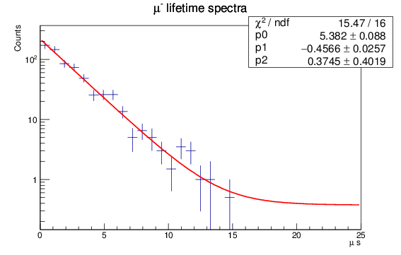

# Muon Lifetime Measurement

Measurement of the lifetime of cosmic-ray muons using scintillation detectors, coincidence electronics, and exponential decay analysis.



---

## Overview

This project measures the mean lifetime of the muon, an unstable elementary particle that decays via the weak interaction.

Muons are continuously produced in Earth's atmosphere when high-energy cosmic rays collide with atomic nuclei. Some of these muons travel to the surface and can be detected using scintillation detectors. When a muon stops inside the detector and subsequently decays, the time interval between its arrival and decay is recorded.

By collecting many such events and fitting the distribution of decay times, the characteristic muon lifetime can be extracted.

---

## Physics Background

The muon ($\mu^\pm$) is a second-generation lepton with a mass approximately 207 times that of the electron. It decays through the weak interaction according to

$$
\mu^- \rightarrow e^- + \bar{\nu}*e + \nu*\mu
$$

and

$$
\mu^+ \rightarrow e^+ + \nu_e + \bar{\nu}_\mu
$$

The probability that a muon survives until time $t$ follows an exponential law:

$$
N(t) = N_0 e^{-t/\tau}
$$

where:

* $N_0$ is the initial number of muons,
* $t$ is the elapsed time,
* $\tau$ is the mean muon lifetime.

The accepted value of the muon lifetime is approximately

$$
\tau_\mu = 2.1969811\ \mu\text{s}
$$

This quantity is fundamental to particle physics and is used to determine the Fermi coupling constant $G_F$, which characterizes the strength of the weak interaction.

---

## Experimental Method

1. Cosmic-ray muons enter the scintillation detector.
2. Some muons lose energy and come to rest inside the detector.
3. The muon decays after a random delay.
4. The detector records two pulses:

   * Arrival (muon stop)
   * Decay (electron or positron emission)
5. The time difference between the two pulses is measured.
6. Thousands of events are accumulated into a histogram.
7. The histogram is fit to an exponential decay model.

---

## Data Analysis

The decay histogram is modeled as

$$
N(t) = A e^{-t/\tau} + B
$$

where:

* $A$ is the normalization,
* $\tau$ is the muon lifetime,
* $B$ is a constant background due to accidental coincidences.

The fitted value of $\tau$ is compared with the accepted value to evaluate the experimental accuracy.

---

## Results

The figure below shows the final decay-time histogram and exponential fit.


The extracted lifetime is expected to be close to

$$
2.2\ \mu\text{s}
$$

demonstrating the characteristic exponential decay of an unstable particle.


---

## Scientific Significance

This experiment provides direct evidence for several fundamental concepts in physics:

* Weak interaction and particle decay
* Radioactive and exponential decay laws
* Poisson counting statistics
* Curve fitting and parameter estimation
* Background subtraction
* Detector instrumentation
* Cosmic-ray physics

Muon lifetime measurements have played an important role in establishing the Standard Model and in determining precise values of electroweak parameters.

---

## Computational Techniques

The data analysis involved:

* Histogram construction
* Nonlinear least-squares fitting
* Uncertainty estimation
* Statistical interpretation of counting data
* Scientific plotting and visualization

These techniques are widely used in experimental particle physics, astronomy, and large-scale scientific data pipelines.

---

## Skills Demonstrated

* Experimental particle physics
* Detector instrumentation
* Signal processing
* Statistical data analysis
* Curve fitting
* Scientific programming
* Data visualization
* Uncertainty quantification

---

## Relevance to Modern Scientific Software

Although this project was conducted as a laboratory experiment, it reflects many of the same principles used in large-scale scientific computing:

* Extracting physical parameters from noisy measurements
* Modeling stochastic processes
* Performing robust statistical fits
* Comparing measurements with theoretical predictions
* Communicating results through clear visualizations

These are the same types of workflows used in particle physics experiments such as ATLAS at CERN and space missions such as SPHEREx.

---


Measured the lifetime of cosmic-ray muons using scintillation detectors and exponential decay fitting, extracting the weak-interaction lifetime of approximately 2.2 microseconds through statistical analysis and uncertainty estimation.

---

## Repository Contents

```text
.
├── README.md
├── mu_lifetime_final.png
├── analysis.py
├── data/
└── report.pdf
```

---

## References

* Particle Data Group (PDG): https://pdg.lbl.gov
* Griffiths, *Introduction to Elementary Particles*
* Knoll, *Radiation Detection and Measurement*
* Leo, *Techniques for Nuclear and Particle Physics Experiments*

